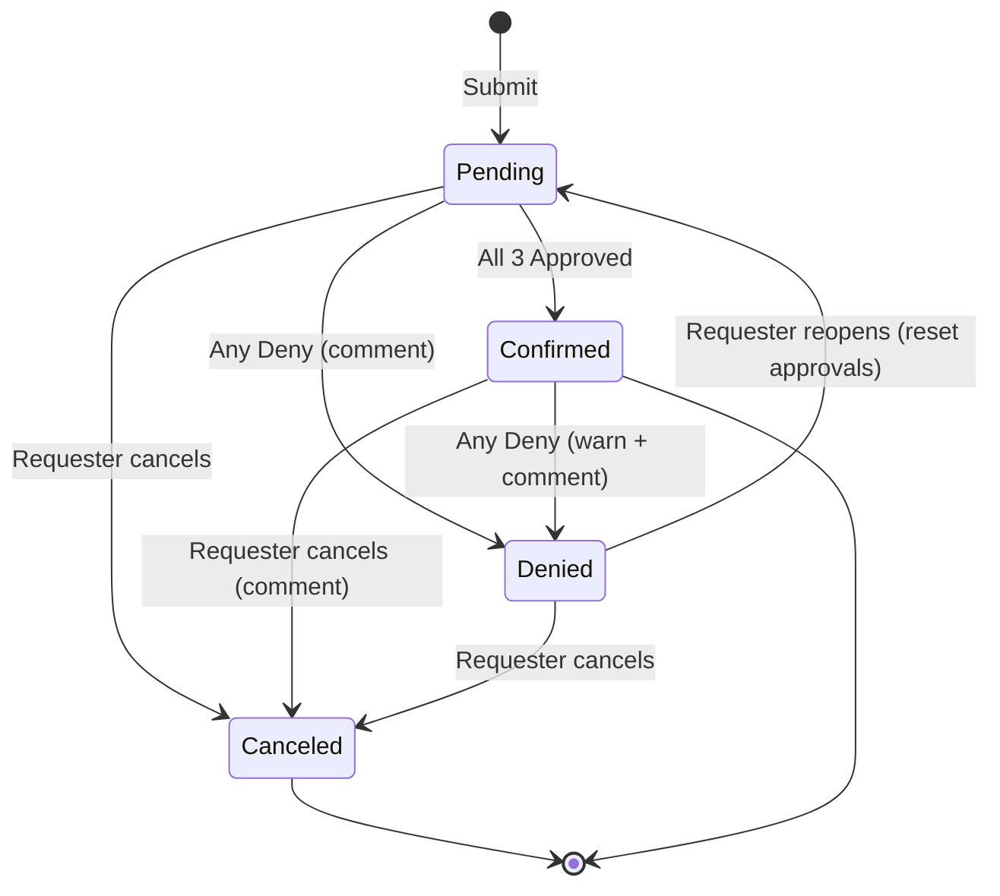

# States & Transitions

## State Diagram

---

## States

### Pending

**Description:** Initial state when booking is submitted. Awaiting all three approvals.

**Characteristics:**
- **Blocks calendar dates** (no overlaps allowed)
- **Visible on public calendar**
- Active decision-making state

**Actors & Capabilities:**

**Requester:**
- View details
- Edit (per BR-005 rules)
- Cancel (no comment required)

**Approvers:**
- View details
- Approve (one-click)
- Deny (requires comment)

**Viewers:**
- View on public calendar
- View details (no comments)

**Approval Tracking:**
- Each approver has decision state: NoResponse, Approved, or Denied
- Progress visible to requester: "Ausstehend: {{Remaining parties}}"

**Transitions From Pending:**
- → **Confirmed:** All three approve
- → **Denied:** Any one denies
- → **Canceled:** Requester cancels
- → **Pending (modified):** Requester edits

---

### Confirmed

**Description:** All three approvers have approved. Booking is finalized.

**Characteristics:**
- **Blocks calendar dates** (no overlaps allowed)
- **Visible on public calendar**
- Stable state (requires explicit action to change)

**Actors & Capabilities:**

**Requester:**
- View details
- Cancel (requires comment via confirmed-cancel dialog)

**Approvers:**
- View details
- Deny (requires warning dialog + comment)

**Viewers:**
- View on public calendar
- View details (no comments)

**Transitions From Confirmed:**
- → **Denied:** Any approver denies (with warning + comment)
- → **Canceled:** Requester cancels (with comment)
- → **[Terminal]:** May remain Confirmed indefinitely (past Confirmed bookings kept for history)

---

### Denied

**Description:** Any approver has denied the booking (with comment). Non-blocking and not public.

**Characteristics:**
- **Does NOT block calendar dates** (dates immediately free)
- **Not visible on public calendar** (hidden)
- Resolution state (requester must decide next action)

**Actors & Capabilities:**

**Requester:**
- View details (including denial comment)
- Reopen (back to Pending with reset approvals)
- Cancel (move to Archive)

**Approvers:**
- View details (including denial comment)
- **Cannot act** (no approve/deny possible while Denied)

**Viewers:**
- **Cannot see** (not public)

**Visibility:**
- Visible to requester (via personal link)
- Visible to approvers (via History in personal link)
- Not visible on public calendar
- Not visible in viewer unlisted URL

**Transitions From Denied:**
- → **Pending:** Requester reopens (all approvals reset to NoResponse)
- → **Canceled:** Requester cancels

---

### Canceled

**Description:** Final state after requester cancels (from any stage) or after Denied then requester cancels.

**Characteristics:**
- **Moved to Archive** (hidden from all views)
- **Terminal state** (no further actions possible)
- Dates freed (if not already)

**Actors & Capabilities:**

**All Actors:**
- **Cannot see** (moved to Archive, no end-user UI)

**Archive Access:**
- No end-user interface
- API/admin only (if needed)
- Purged per BR-013 archival policy

**Visibility:**
- Not visible on public calendar
- Not visible in requester personal link
- Not visible in approver Outstanding
- Not visible in approver History
- Hidden from all end users

**Terminal:** No transitions from this state.

---

## Transitions

### Submit → Pending

**Trigger:** Requester submits new booking

**Preconditions:**
- Valid date range (`StartDate ≤ EndDate`)
- Future horizon check (`StartDate ≤ today + FUTURE_HORIZON_MONTHS`)
- No conflicts with Pending/Confirmed bookings
- Long stay confirmation (if `TotalDays > LONG_STAY_WARN_DAYS`)
- First-write-wins (no concurrent booking of same dates)

**Actions:**
- Create booking record
- Set status = Pending
- Set all approver decisions = NoResponse
- If requester is approver, auto-apply self-approval (BR-015)
- Create timeline event: Submitted

**Notifications:**
- Email to approvers (except self-approver)

**Effects:**
- Dates blocked on calendar
- Visible on public calendar

---

### Pending → Confirmed

**Trigger:** Third and final approver approves

**Preconditions:**
- Status = Pending
- Two approvers already approved
- Third approver clicks Approve

**Actions:**
- Update third approver decision = Approved
- Set status = Confirmed
- Create timeline event: Confirmed

**Notifications:**
- Email to requester (final confirmation)
- Email to all three approvers (celebration)
- Suppress requester's "last approver" intermediate notification

**Effects:**
- Dates remain blocked
- Status badge updates to "Bestätigt"
- Visible on public calendar

---

### Pending → Denied

**Trigger:** Any approver denies (with comment)

**Preconditions:**
- Status = Pending
- Approver provides comment

**Actions:**
- Update denying approver decision = Denied
- Store comment
- Set status = Denied
- Create timeline event: Denied (with named party)

**Notifications:**
- Email to **everyone** (Requester + all three approvers)
- Include denial reason

**Effects:**
- **Dates immediately free** (non-blocking)
- **Hidden from public calendar**
- Other approver decisions remain (but no longer actionable)

---

### Confirmed → Denied

**Trigger:** Any approver denies confirmed booking (with warning + comment)

**Preconditions:**
- Status = Confirmed
- Approver sees warning dialog and confirms
- Approver provides comment

**Actions:**
- Update denying approver decision = Denied (overrides previous Approved)
- Store comment
- Set status = Denied
- Create timeline event: Denied (with named party)

**Notifications:**
- Email to **everyone** (Requester + all three approvers)
- Include denial reason

**Effects:**
- **Dates immediately free** (non-blocking)
- **Hidden from public calendar**

---

### Pending → Canceled

**Trigger:** Requester cancels Pending booking

**Preconditions:**
- Status = Pending
- Requester authenticated via personal link
- Not past-dated

**Actions:**
- Set status = Canceled
- Move to Archive
- Create timeline event: Canceled (by Requester)

**Notifications:**
- Email to **Requester + all three approvers**
- No comment required

**Effects:**
- Dates freed (if not already)
- Hidden from all views (moved to Archive)

---

### Confirmed → Canceled

**Trigger:** Requester cancels Confirmed booking (with comment)

**Preconditions:**
- Status = Confirmed
- Requester sees confirmed-cancel dialog and confirms
- Requester provides comment
- Not past-dated

**Actions:**
- Store cancellation comment
- Set status = Canceled
- Move to Archive
- Create timeline event: Canceled (by Requester, with comment)

**Notifications:**
- Email to **Requester + all three approvers**
- Include cancellation reason

**Effects:**
- Dates freed
- Hidden from all views (moved to Archive)

---

### Denied → Pending

**Trigger:** Requester reopens Denied booking

**Preconditions:**
- Status = Denied
- Requester authenticated via personal link
- Edited dates (if any) do not conflict with Pending/Confirmed bookings (BR-018)
- Not past-dated

**Actions:**
- Set status = Pending
- **Reset all approver decisions to NoResponse** (fresh start)
- Update fields if edited (dates, party size, affiliation, description, first name)
- Create timeline event: Reopened

**Notifications:**
- Email to all three approvers (re-approval request)
- Include diffs if dates changed

**Effects:**
- Dates blocked again
- Visible on public calendar
- Follows normal approval flow

---

### Denied → Canceled

**Trigger:** Requester cancels Denied booking

**Preconditions:**
- Status = Denied
- Requester authenticated via personal link

**Actions:**
- Set status = Canceled
- Move to Archive
- Create timeline event: Canceled (by Requester)

**Notifications:**
- Email to **Requester only** (approvers already informed by Deny email)

**Effects:**
- Dates already free (freed on Deny)
- Hidden from all views (moved to Archive)

---

### Pending → Pending (Edit)

**Special Case:** Not a true state transition, but an in-place modification.

**Trigger:** Requester edits Pending booking

**Effects Depend on Edit Type:**

**Shorten dates within original bounds:**
- Approvals remain
- Date edit logged
- Status remains Pending

**Extend dates (earlier start or later end):**
- **All approvals reset to NoResponse**
- Date edit logged
- Re-approval emails sent
- Status remains Pending (but reset)

**Party size or affiliation only:**
- Approvals remain
- No timeline log
- Status remains Pending

**First name only:**
- Approvals remain
- No timeline log
- Status remains Pending

See Journey 5.4 for detailed edit scenarios.

---

### Past-Dated Auto-Cleanup (Pending → Canceled)

**Trigger:** System job runs at EndDate+1 00:00 Europe/Berlin

**Preconditions:**
- Status = Pending
- `EndDate < today`

**Actions:**
- Set status = Canceled
- Move to Archive
- Create timeline event: Canceled (by System, auto-cleanup)

**Notifications:**
- **None** (quiet cleanup)

**Effects:**
- Dates already past (no longer relevant)
- Hidden from all views

---

## State Properties Summary

| State | Blocks Dates | Public Visible | Requester Can | Approver Can |
|-------|--------------|----------------|---------------|--------------|
| **Pending** | ✓ Yes | ✓ Yes | View, Edit, Cancel | View, Approve, Deny |
| **Confirmed** | ✓ Yes | ✓ Yes | View, Cancel (comment) | View, Deny (warn+comment) |
| **Denied** | ✗ No | ✗ No | View, Reopen, Cancel | View (no actions) |
| **Canceled** | ✗ No | ✗ No (Archive) | — (hidden) | — (hidden) |

---

## Approval Decision States

Each approver has a decision state for each booking:

### NoResponse
- **Initial state** when booking submitted (or reset on Reopen/Extend)
- Approver has not yet decided
- Counted in "outstanding" approvals
- Included in weekly digest (if aged ≥5 days)

### Approved
- Approver clicked Approve
- Permanent (unless booking Reopened or dates Extended)
- Contributes to Confirmed (when all three Approved)

### Denied
- Approver clicked Deny (with comment)
- Immediately transitions booking to Denied state
- Overrides any previous Approved state (if denying Confirmed)
- Permanent for this booking instance (reset only on Reopen)

---

## Concurrency & Race Conditions

### First-Action-Wins (Approvals/Denials)
**Scenario:** Two approvers act on same booking simultaneously

**Resolution:**
- First action to persist wins
- Later action sees "Schon erledigt" result page
- Both actions are idempotent-safe

**Examples:**
- Both try to give final approval → First wins, second sees "already Confirmed"
- One approves, one denies simultaneously → First wins
- Two try to deny → First wins, second sees "already Denied"

### First-Write-Wins (Create/Extend)
**Scenario:** Two users try to book same dates simultaneously

**Resolution:**
- First submission to persist wins
- Later submission gets conflict error
- Conflict summary shows first name + status of winner

**Applies to:**
- New booking submissions
- Edit operations that extend date ranges

---

## Terminal States

### Confirmed (Conditional Terminal)
- Can remain indefinitely
- Past Confirmed bookings kept for history (never purged per BR-013)
- Can transition to Denied or Canceled

### Canceled (True Terminal)
- No transitions out
- Hidden in Archive
- Purged per BR-013 after 1 year (except past Confirmed)

---

## State Visibility Matrix

| State | Public Calendar | Requester Link | Approver Outstanding | Approver History | Viewer (Unlisted) |
|-------|----------------|----------------|---------------------|------------------|-------------------|
| **Pending** | ✓ | ✓ | ✓ (if NoResponse) | ✓ | ✓ |
| **Confirmed** | ✓ | ✓ | — | ✓ | ✓ |
| **Denied** | — | ✓ | — | ✓ | — |
| **Canceled** | — | — | — | — | — |

**Legend:**
- ✓ = Visible
- — = Not visible
