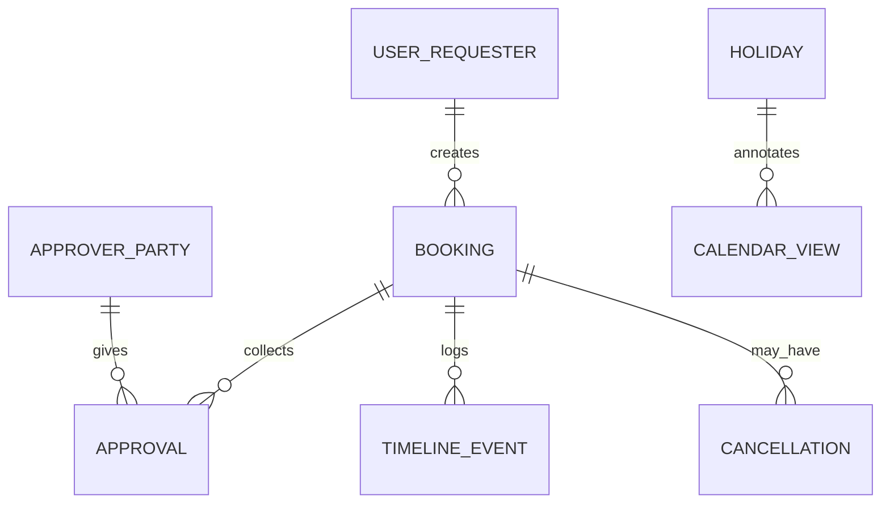

# Business Data Model

## Overview

This document defines the data entities, their properties, relationships, and validation rules.

---

## Entity Relationship Diagram



---

## BOOKING

Primary entity representing a booking request.

### Properties

| Property | Type | Constraints | Description |
|----------|------|-------------|-------------|
| `BookingID` | UUID | Primary key, required | Unique identifier |
| `StartDate` | Date | Required | First day of booking (inclusive) |
| `EndDate` | Date | Required, ≥ StartDate | Last day of booking (inclusive) |
| `TotalDays` | Int | Computed, ≥ 1 | `EndDate - StartDate + 1` |
| `PartySize` | Int | Required, 1 ≤ n ≤ MAX_PARTY_SIZE (default 10) | Number of people (including requester) |
| `Description` | String | Optional, ≤500 chars | Plaintext; no links; emojis/newlines OK |
| `RequesterFirstName` | String | Required, ≤40 chars | Letters/diacritics/space/hyphen/apostrophe; trim |
| `RequesterEmail` | String | Required, unique (lowercase-normalized), ≤254 chars (configurable) | Hidden PII; immutable; validated |
| `Affiliation` | Enum | Required | `Ingeborg \| Cornelia \| Angelika` (visual only) |
| `Status` | Enum | Required | `Pending \| Denied \| Confirmed \| Canceled` |
| `CreatedAt` | DateTime | Required, auto-set | Submission timestamp (UTC) |
| `UpdatedAt` | DateTime | Required, auto-update | Last modification timestamp (UTC) |
| `LastActivityAt` | DateTime | Required, auto-update | Latest TimelineEvent.When (UTC) |

### Status Values

- **Pending:** Awaiting all three approvals
- **Denied:** Any approver denied (non-blocking, not public)
- **Confirmed:** All three approved
- **Canceled:** Terminal state (moved to Archive)

### Affiliation Values

Visual association only; all three approvals always required:
- **Ingeborg:** Color `#C1DBE3`
- **Cornelia:** Color `#C7DFC5`
- **Angelika:** Color `#DFAEB4`

### Validation Rules

**StartDate:**
- Must be ≤ `today + FUTURE_HORIZON_MONTHS` (default 18)
- Must be ≤ EndDate

**EndDate:**
- Must be ≥ StartDate
- Inclusive (booking covers StartDate through EndDate)

**TotalDays:**
- Computed: `EndDate - StartDate + 1`
- If > LONG_STAY_WARN_DAYS (default 7), require confirmation

**PartySize:**
- Integer 1 to MAX_PARTY_SIZE (default 10)
- Always display as "n Personen"

**Description:**
- Optional (may be null/empty)
- Plaintext only
- No links (`http://`, `https://`, `www`, `mailto:` blocked per BR-020)
- Emojis allowed
- Newlines allowed
- Max 500 characters

**RequesterFirstName:**
- Required (non-empty after trim)
- Allowed: Letters (incl. diacritics like ä, ö, ü, ß), spaces, hyphen (-), apostrophe (')
- Trim leading/trailing whitespace
- Max 40 characters
- No emojis
- No newlines

**RequesterEmail:**
- Required
- **Immutable** (cannot be changed after creation)
- Validated per email validation rules (see below)
- Normalized to lowercase for uniqueness
- Never displayed in UI (PII)
- Max length: 254 characters (configurable via EMAIL_MAX_LEN)

### Business Rules

- **BR-001:** Inclusive end date; `TotalDays = EndDate - StartDate + 1`
- **BR-002:** No overlaps with Pending/Confirmed bookings
- **BR-014:** Past items (`EndDate < today`) are read-only
- **BR-026:** Future horizon check on StartDate
- **BR-027:** Long stay confirmation if TotalDays exceeds threshold

---

## APPROVER_PARTY

Fixed set of three approvers.

### Properties

| Property | Type | Constraints | Description |
|----------|------|-------------|-------------|
| `PartyID` | UUID | Primary key, required | Unique identifier |
| `Name` | Enum | Required, unique | `Ingeborg \| Cornelia \| Angelika` |
| `DisplayName` | String | Required | Human-readable name (German) |
| `ApproverEmail` | String | Required, unique, ≤254 chars | Hidden PII; validated |
| `PersonalLinkToken` | String | Required, unique | Signed token (no expiry) |

### Fixed Set

Three approvers (hardcoded names, emails configurable in DB):

1. **Ingeborg**
2. **Cornelia**
3. **Angelika**

### Personal Link Token

- Signed token tied to approver email
- No expiry (per BR-010)
- No revocation mechanism
- Resend existing token on recovery (don't generate new)
- Used to authenticate approver actions

### Business Rules

- **BR-003:** All three must approve for Confirmed
- **BR-010:** Tokens have no expiry, no revocation

---

## APPROVAL

Tracks each approver's decision on each booking.

### Properties

| Property | Type | Constraints | Description |
|----------|------|-------------|-------------|
| `ApprovalID` | UUID | Primary key, required | Unique identifier |
| `BookingID` | UUID | Foreign key, required | Reference to BOOKING |
| `Party` | Enum | Required | `Ingeborg \| Cornelia \| Angelika` |
| `Decision` | Enum | Required | `NoResponse \| Approved \| Denied` |
| `CommentIfDenied` | String | Optional, ≤500 chars | Required if Decision = Denied; plaintext; no links; emojis/newlines OK |
| `DecidedAt` | DateTime | Optional | Timestamp when decision made (UTC); null if NoResponse |

### Decision Values

- **NoResponse:** Initial state; no decision yet; approver has not acted
- **Approved:** Approver clicked Approve
- **Denied:** Approver clicked Deny (with comment)

### Relationships

- Each BOOKING has exactly three APPROVAL records (one per fixed approver)
- Created when booking submitted
- Updated when approver acts

### CommentIfDenied Rules

- **Required** if `Decision = Denied`
- Plaintext only
- No links (`http://`, `https://`, `www`, `mailto:` blocked)
- Emojis allowed
- Newlines allowed
- Max 500 characters

### Business Rules

- **BR-004:** Deny requires comment
- **BR-015:** Self-approval auto-applied if requester is approver
- **BR-024:** First-action-wins for concurrent approvals/denials

---

## CANCELLATION

Optional record for canceled bookings (stores cancellation details).

### Properties

| Property | Type | Constraints | Description |
|----------|------|-------------|-------------|
| `CancelID` | UUID | Primary key, required | Unique identifier |
| `BookingID` | UUID | Foreign key, required | Reference to BOOKING |
| `InitiatedBy` | Enum | Required | Currently only: `Requester` |
| `Message` | String | Optional, ≤500 chars | Required if canceling Confirmed; plaintext; no links; emojis/newlines OK |
| `CreatedAt` | DateTime | Required, auto-set | Cancellation timestamp (UTC) |

### InitiatedBy Values

- **Requester:** Only requesters can cancel (approvers cannot)

### Message Rules

- **Required** if canceling Confirmed booking (via confirmed-cancel dialog)
- **Optional** if canceling Pending or Denied
- Plaintext only
- No links
- Emojis allowed
- Newlines allowed
- Max 500 characters

### Business Rules

- **BR-006:** Cancel Pending (no comment required)
- **BR-007:** Cancel Confirmed (comment required)
- **BR-028:** System auto-cancels past Pending bookings (no CANCELLATION record needed, or InitiatedBy = System)

---

## TIMELINE_EVENT

Audit log of actions on a booking.

### Properties

| Property | Type | Constraints | Description |
|----------|------|-------------|-------------|
| `EventID` | UUID | Primary key, required | Unique identifier |
| `BookingID` | UUID | Foreign key, required | Reference to BOOKING |
| `When` | DateTime | Required | Event timestamp (UTC) |
| `Actor` | Enum | Required | `Requester \| Approver \| System` |
| `EventType` | Enum | Required | See EventType values below |
| `Note` | String | Optional, internal | Additional context (e.g., diffs, auto-cancel reason) |

### Actor Values

- **Requester:** Person who created booking
- **Approver:** Named approver (Ingeborg, Cornelia, or Angelika) - store specific name in Note or separate field
- **System:** Automated actions (e.g., auto-cleanup)

### EventType Values

- **Submitted:** Initial submission
- **Approved:** Approver approved (store approver name)
- **Denied:** Approver denied (store approver name)
- **EditedAffectsApproval:** Date edit that reset approvals (store diff)
- **EditedNoApprovalChange:** Date edit that kept approvals (store diff)
- **Confirmed:** All three approved (final approval)
- **Canceled:** Requester canceled (or System auto-canceled)
- **Reopened:** Requester reopened from Denied

### Note Field

Internal field for context:
- Date diffs: "01.–05.08. → 03.–08.08."
- Auto-cancel reason: "Auto-canceled past-dated pending booking"
- Approver name for Approved/Denied events

### Logged vs Not Logged

**Logged:**
- Submitted
- Approved (by named party)
- Denied (by named party)
- **All date edits** (with diffs and approval impact)
- Confirmed
- Canceled
- Reopened

**NOT Logged:**
- Party size edits
- Affiliation edits
- First name edits
- Description edits
- Digest/system events (not public-facing in timeline)

### Visibility

**Requester:**
- Sees all events on own bookings
- Comments visible per visibility rules

**Approver:**
- Sees all events on bookings involving them
- All comments visible

**Viewer:**
- Sees actors + actions only
- No comments
- No detailed notes

### Business Rules

- **BR-005:** Date edits logged with diff
- Timeline drives `LastActivityAt` on BOOKING

---

## USER_REQUESTER

Represents a person who created one or more bookings.

### Properties

| Property | Type | Constraints | Description |
|----------|------|-------------|-------------|
| `RequesterID` | UUID | Primary key, required | Unique identifier |
| `FirstName` | String | Required, ≤40 chars | Letters/diacritics/space/hyphen/apostrophe; trim |
| `Email` | String | Required, unique (lowercase-normalized), ≤254 chars | Hidden PII; normalized; immutable |
| `PersonalLinkToken` | String | Required, unique | Signed token (no expiry) |

### Notes

- May represent same concept as BOOKING.RequesterEmail (denormalized)
- Or may be separate entity aggregating multiple bookings
- Implementation choice: embedded in BOOKING vs separate USER table

### Personal Link Token

- Signed token tied to requester email
- No expiry (per BR-010)
- No revocation mechanism
- Resend existing token on recovery
- Used to authenticate requester actions

### Business Rules

- **BR-010:** Tokens have no expiry, no revocation
- **BR-021:** Soft cooldown (60s) on link recovery

---

## HOLIDAY

Optional: German holidays for visual calendar annotation.

### Properties

| Property | Type | Constraints | Description |
|----------|------|-------------|-------------|
| `HolidayID` | UUID | Primary key, required | Unique identifier |
| `Day` | Date | Required | Holiday date |
| `Region` | String | Required | e.g., "DE" or "DE-NRW" (global config) |
| `Label` | String | Required | Holiday name (German) |

### Configuration

- **Global region config** (e.g., "DE" or "DE-NRW")
- **Optional:** Visual only; hidden if unavailable
- **No business logic:** Bookings allowed on holidays

### Display

- Visual annotation on calendar
- Different styling (color, badge)
- Label on hover/tap (if supported)

---

## CALENDAR_VIEW

Configuration for calendar display (not a database entity; system config).

### Properties

| Property | Value | Description |
|----------|-------|-------------|
| `Locale` | `de-DE` | German locale |
| `Timezone` | `Europe/Berlin` | Timezone for all date/time operations |
| `WeekStartsOn` | `Monday` | Week start day |
| `DateFormat` | `DD.–DD.MM.YYYY` | Display format (e.g., "01.–05.08.2025") |

---

## Validation Rules

### Email Validation

**Rules:**
- Trim whitespace (leading/trailing)
- **No spaces** within email
- Exactly **one `@`** symbol
- Local part (before @) non-empty
- Domain (after @) contains **at least one dot**
- TLD (last part after dot) is **2–24 letters**
- **Max length:** 254 characters (default; configurable via EMAIL_MAX_LEN)

**Example Regex (non-normative):**
```regex
^[^\s@]+@[A-Za-z0-9.-]+\.[A-Za-z]{2,24}$
```

**Error Copy (German):**
```
Bitte gib eine gültige E-Mail-Adresse an.
```

### Mistyped Email Policy

If requester enters incorrect email:
- **Cannot edit email** (immutable per BR spec)
- User must **create new booking** with correct email
- Original booking **blocks dates** until:
  - Approver denies it (on request), or
  - Auto-cancels once past (EndDate+1 00:00) per BR-028

### First Name Validation (BR-019)

**Allowed Characters:**
- Letters (A-Z, a-z)
- Diacritics (ä, ö, ü, ß, é, à, etc.)
- Spaces
- Hyphen (-)
- Apostrophe (')

**Processing:**
- Trim leading/trailing whitespace

**Constraints:**
- Non-empty after trim
- Max 40 characters
- No emojis
- No newlines

**Error Copy (German):**
```
Bitte gib einen gültigen Vornamen an (Buchstaben, Leerzeichen, Bindestrich, Apostroph; max. 40 Zeichen).
```

### Link Detection (BR-020)

**Blocked Patterns in Description/Comments:**
- `http://`
- `https://`
- `www`
- `mailto:`

**Purpose:** Prevent spam and phishing

**Error Copy (German):**
```
Links sind hier nicht erlaubt. Bitte Text ohne Links verwenden.
```

---

## Data Lifecycle

### Creation

**Booking Submission:**
1. Create BOOKING record (Status = Pending)
2. Create three APPROVAL records (all NoResponse)
3. If requester is approver, update their APPROVAL to Approved (BR-015)
4. Create TIMELINE_EVENT (Submitted)
5. Set LastActivityAt = CreatedAt

### Updates

**Approvals/Denials:**
- Update APPROVAL.Decision
- Create TIMELINE_EVENT
- Update BOOKING.LastActivityAt

**Edits:**
- Update BOOKING fields
- Create TIMELINE_EVENT (if date edit)
- Reset APPROVAL decisions if dates extended
- Update BOOKING.UpdatedAt and LastActivityAt

**State Transitions:**
- Update BOOKING.Status
- Create TIMELINE_EVENT
- Update BOOKING.LastActivityAt

### Archival (BR-013)

**When Status → Canceled:**
- Move to Archive (implementation: soft delete flag or separate table)
- Hidden from all end-user views

**Purge Policy (Monthly Job):**
- **Canceled items:** Purge when archived > 1 year
- **Past Confirmed items:** Never purged (kept for history)
- **Denied items:** Purge once EndDate < today

### Auto-Cleanup (BR-028)

**Daily Job at 00:00 Europe/Berlin:**
- Find Pending bookings where EndDate < today
- Set Status → Canceled
- Create TIMELINE_EVENT (Actor = System)
- Move to Archive
- **No notifications sent**

---

## Audit Scope

### What's Logged

**Timeline Events:**
- Submitted
- Approved (with approver name)
- Denied (with approver name; comment visible per visibility rules)
- **All date edits** (with old→new diff and approval reset indicator)
- Confirmed
- Canceled (with comment if Confirmed)
- Reopened

### What's NOT Logged

**Not in Timeline:**
- Party size edits
- Affiliation edits
- First name edits
- Description edits
- Digest events (internal)

**Rationale:** Only date changes affect approvals; other fields are cosmetic.

---

## Indexes & Performance

### Recommended Indexes

**BOOKING:**
- Primary key: BookingID
- Unique: RequesterEmail (lowercase-normalized)
- Index: Status (for filtering Pending/Confirmed/Denied)
- Index: StartDate, EndDate (for conflict detection)
- Index: LastActivityAt (for sorting)
- Index: CreatedAt (for age calculations in digest)

**APPROVAL:**
- Primary key: ApprovalID
- Foreign key: BookingID
- Composite: (BookingID, Party) - unique
- Index: Decision (for filtering NoResponse)

**TIMELINE_EVENT:**
- Primary key: EventID
- Foreign key: BookingID
- Index: When (for chronological ordering)

---

## Data Model Summary

| Entity | Purpose | Key Relationships |
|--------|---------|-------------------|
| **BOOKING** | Core booking request | Has many APPROVAL, TIMELINE_EVENT |
| **APPROVER_PARTY** | Fixed set of three approvers | Has many APPROVAL |
| **APPROVAL** | Per-approver decision on booking | Belongs to BOOKING and APPROVER_PARTY |
| **CANCELLATION** | Optional cancellation details | Belongs to BOOKING |
| **TIMELINE_EVENT** | Audit log of actions | Belongs to BOOKING |
| **USER_REQUESTER** | Person who creates bookings | Creates BOOKING |
| **HOLIDAY** | German holidays (optional) | Calendar annotation |
| **CALENDAR_VIEW** | Display configuration | System config (not DB entity) |

---

## Implementation Notes

### Database Choice
- Relational DB recommended (PostgreSQL, MySQL)
- Strong ACID guarantees for conflict detection (first-write-wins)
- Transaction support for approval state changes

### Timezone Handling
- Store all timestamps in UTC
- Convert to Europe/Berlin for display/business logic
- Flip to "past" at 00:00 Europe/Berlin

### Conflict Detection
- Use database transactions with appropriate isolation level
- Lock date range during create/extend operations (first-write-wins)
- Recheck conflicts before committing

### Token Management
- Use cryptographic signing (HMAC, JWT, or similar)
- Include email and role in token payload
- Validate signature on every request
- No server-side token storage required (stateless)

### Email Normalization
- Normalize to lowercase before uniqueness check
- Trim whitespace
- Store original case if needed for display (though emails never displayed)
